## はじめに

前回の記事「[はてなブログから Hugo に移行した](/post/migrated-blog-hatena-to-hugo/)」の続き。  
勉強を兼ねて AWS 上にインフラを構築してブログサイト（このサイトのこと）を公開してみた。  
本記事ではサイトを公開するまでの手順やコードの解説をする。

## 構成


- AWS 上のリソースは Terraform で構築
- 静的サイトジェネレーター Hugo を使用してコンテンツを生成
- 静的サイトジェネレーターのソースコードの管理（ブログ記事の管理）は GitHub
- GitHub Actions を構成して、記事をコミットすると GitHub 側でビルドして S3 に自動で配置
- S3 のコンテンツを CloudFront でキャッシュ＆デリバリ
- HTTPS で公開したいので、SSL 証明書を ACM（AWS Certificate Manager）で発行

## サイト公開までの流れ

### 環境

- Windows 10 Home
- Chocolatey v1.2.1
- [Hugo v0.109.0 extended](https://gohugo.io/)
- [Hugo theme Stack](https://stack.jimmycai.com/)
- aws-cli v2.9.10
- Terraform v1.1.2

### Hugo の準備

#### Hugo のインストール

Hugo をローカル環境にインストールする。  
テーマに Stack を使いたいので、Hugo は拡張バージョンをインストールする。

```powershell
# ChocolateyでHugo拡張版をインストール
choco install -y -f hugo-extended

# hugo versionコマンドを実行して、パスが通っていること＆extendedが記載されていることを確認
hugo version
> hugo v0.109.0-47b12b83e636224e5e601813ff3e6790c191e371+extended windows/amd64 BuildDate=2022-12-23T10:38:11Z VendorInfo=gohugoio
```

#### サイトの作成

サイトの作成は`hugo new site`コマンドで行う。

```powershell
hugo new site blog-nns7
```

#### サイトのバージョン管理

サイトのバージョン管理を Git で行うため`git init`コマンドを実行。

```powershell
cd blog-nns7
git init
```

gitignore ファイルはこんな感じにした。

```text{ name=".gitignore" }
/public/
/resources/
.hugo_build.lock
```

#### テーマの追加

Stack ではテーマをサブモジュールとして管理できるため、`git submodule add`コマンドでサブモジュールを追加する。

```powershell
git submodule add https://github.com/CaiJimmy/hugo-theme-stack/ themes/hugo-theme-stack
```

#### サンプルページの確認

Stack にはサンプルページが用意されている。  
サンプルページを確認したい場合は`exampleSite/content`ディレクトリ配下と`exampleSite/config.yml`ファイルをコピーする。

```powershell
cp -r ./themes/hugo-theme-stack/exampleSite/content/* ./content/
cp -r ./themes/hugo-theme-stack/exampleSite/config.yaml ./
# コピーしたconfig.yamlと、もともといるconfig.tomlが競合するため、tomlファイルを削除
rm ./config.toml
```

#### Hugo をローカルでサーブする

`hugo serve`コマンドを実行すると、ローカルでサーバーを起動する。  
[http://localhost:1313](http://localhost:1313)にアクセスすると、サンプルページをブラウズすることができる。  
サーバーを停止する時は`Ctrl+C`キーを入力する。

```powershell
hugo serve -D
```

#### オリジナルページを作成する

オリジナルページを作成する時は`hugo new`コマンドを実行する。  
Stack ではページは`index.md`というファイル名で作成する必要がある。

```powershell
rm -f ./content/* # サンプルページの削除
hugo new post/test/index.md
```

とりあえずテスト投稿として`index.md`の内容は以下のようにした。

```text{name="/content/post/test/index.md"}
---
title: "Test"
date: 2022-12-30T17:59:31+09:00
draft: true
---
## テスト投稿
こんにちは
```

### AWS の準備

#### AWS CLI のインストール

Terraform で使用する AWS 認証情報（クレデンシャル）を設定するため AWS CLI をインストールする。

```powershell
choco install -y -f awscli

# パスが通っていることを確認
aws --version
> aws-cli/2.9.10 Python/3.9.11 Windows/10 exe/AMD64 prompt/off
```

#### AWS 認証情報（クレデンシャル）の設定

以下を参考に、管理者ユーザーを作成し、アクセスキー ID とシークレットアクセスキーを発行しておく。

- [AWS CLI バージョン 2 を使用するための前提条件](https://docs.aws.amazon.com/ja_jp/cli/latest/userguide/getting-started-prereqs.html)

AWS CLI からアクセスキー ID とシークレットアクセスキーを設定する。  
以下の例では料金が安い us-west-2（オレゴン）リージョンを Default にしているが、ここは必要に応じて書き換える。

```powershell
aws configure
> AWS Access Key ID [None]: <発行したアクセスキーIDを入力>
> AWS Secret Access Key [None]: <発行したシークレットアクセスキーを入力>
> Default region name [None]: us-west-2
> Default output format [None]: json
```

設定した情報は`~/.aws/config`ファイルおよび`~/.aws/credentials`ファイルに保存される。

```powershell
Get-Content ~/.aws/config
> [default]
> region = us-west-2
> output = json

Get-Content ~/.aws/credentials
> [default]
> aws_access_key_id = <アクセスキーID>
> aws_secret_access_key = <シークレットアクセスキー>
```

#### Terraform のインストール

続けて Chocolatey から Terraform をインストールする。

```powershell
choco install -y -f terraform

# パスが通っていることを確認
terraform version
> Terraform v1.1.2
> on windows_amd64
```

AWS のクレデンシャルは、デフォルトでは`~/.aws/config`ファイルおよび`~/.aws/credentials`ファイルを参照するようになっている。

> The AWS Provider can source credentials and other settings from the shared configuration and credentials files. By default, these files are located at `$HOME/.aws/config` and `$HOME/.aws/credentials` on Linux and macOS, and `"%USERPROFILE%\.aws\config"` and `"%USERPROFILE%\.aws\credentials"` on Windows.
> If no named profile is specified, the `default` profile is used. Use the `profile` parameter or `AWS_PROFILE` environment variable to specify a named profile.

- [AWS Provider | Shared Configuration and Credentials Files](https://registry.terraform.io/providers/hashicorp/aws/latest/docs#shared-configuration-and-credentials-files)

#### tfstate 管理用 S3 バケットを作成

Terraform では「tfstate」というファイルを用いて構築状態を管理する。  
個人用であればローカル管理でも良いかもしれないが、ベストプラクティスはオンラインストレージに保存するようなので、tfstate 管理用の S3 バケットを作成する。  
S3 バケットの作成には Terraform ではなく CloudFormation を用いる。（Terraform で作成すると tfstate 管理用 S3 バケットの構築状態を管理する tfstate ファイルが発生してしまうため）

以下のバケット名を適当な値に変更したら CloudFormation を実行する。  
AWS CLI から実行できるかもしれないが、筆者は AWS マネジメントコンソールから yaml ファイルをアップロードして実行した。

```yaml{name="tfstate-s3bucket.yml",hl_lines=7}
AWSTemplateFormatVersion: 2010-09-09
Description: This CloudFormation template to create S3 Bucket

Parameters:
  S3BucketName:
    Type: String
    Default: <バケット名を入力>
    Description: Type of this BacketName.

Resources:
  S3Bucket:
    Type: AWS::S3::Bucket
    Properties:
      BucketName: !Ref S3BucketName
      # バケットに保存するオブジェクトをAES256でサーバーサイド暗号化する
      BucketEncryption:
        ServerSideEncryptionConfiguration:
          - ServerSideEncryptionByDefault:
              SSEAlgorithm: AES256
      # パブリックアクセスを全てブロック
      PublicAccessBlockConfiguration:
        BlockPublicAcls: True
        BlockPublicPolicy: True
        IgnorePublicAcls: True
        RestrictPublicBuckets: True

Outputs:
  S3BucketName:
    Value: !Ref S3Bucket
```

#### ACM で SSL 証明書の発行

HTTPS で公開したいので、ACM でパブリック証明書（無料）を発行する。  
筆者はお名前.com でドメインを取得したため、AWS マネジメントコンソールから証明書をリクエストし、お名前.com の DNS サーバーに CNAME レコードを追加する手順を踏んだ。

CNAME 検証のやり方は以下の記事が詳しい。  
なおリンク先の記事にも書いてあるが、**CloudFront に使用する証明書は us-east-1（バージニア北部）リージョンで作成する必要がある**ため注意。



### Terraform で AWS リソースを構築

#### ディレクトリ

```powershell
.
├── .terraform
├── modules/
│   ├── addIndexFunction.js
│   ├── cloudfront.tf
│   ├── iam.tf
│   ├── s3.tf
│   └── variables.tf
├── .gitignore
├── .terraform.lock.hcl
├── main.tf
├── terraform.tfvars
└── variables.tf
```

#### ソースコードの解説

Terraform のソースコードは GitHub で公開しているため、要点だけ解説する。



##### Terraform 設定ファイル

7 行目には先の手順で作成した tfstate 管理用 S3 バケット名を指定する。  
17 ～ 23 行目では child module に`./terraform.tfvars`ファイルで設定した変数を渡している。

```terraform{name="./main.tf",linenos=table,hl_lines=["7","17-23"]}
# --------------------------------
# Terraform configuration

terraform {
  required_version = "= 1.1.2"
  backend "s3" {
    bucket = <tfstate 管理用 S3 バケット名を入力>
    region = "us-west-2"
    key    = "terraform.tfstate"
  }
}

provider "aws" {
  region = "us-west-2"
}

module "aws" {
  source         = "./modules"
  aws_account_id = var.aws_account_id
  certificate_id = var.certificate_id
  github_account = var.github_account
  github_repo    = var.github_repo
}
```

`./terraform.tfvars`ファイルの中身はというと、`.tfvars`ファイルをバージョン管理の対象外とし、以下のような GitHub で公開したくない情報を記述するようにした。

```terraform{name="./terraform.tfvars"}
aws_account_id = <AWSアカウントID>
certificate_id = <ACMで発行した証明書のID>
github_account = <GitHubアカウント>
github_repo    = <GitHubリポジトリ>
```

##### 静的サイト公開用 S3 バケット作成

静的サイト公開用 S3 バケットは CloudFront からのアクセスのみ許可したいため、以下の設定を行う。

- パブリックアクセスを全てブロック
- バケットポリシーに OAC (Origin Access Control)を設定し、CloudFront Distribution からのアクセスのみ許可



```terraform{name="./modules/s3.tf",linenos=table,hl_lines=["4","10","16-19"]}
# --------------------------------
# 静的サイト公開用バケット
resource "aws_s3_bucket" "hugo" {
  bucket = <バケット名を入力>
}

## バケットポリシー
resource "aws_s3_bucket_policy" "hugo" {
  bucket = aws_s3_bucket.hugo.bucket
  policy = data.aws_iam_policy_document.s3_hugo_policy.json
}

## パブリックアクセスの設定
resource "aws_s3_bucket_public_access_block" "hugo" {
  bucket                  = aws_s3_bucket.hugo.bucket
  block_public_acls       = true
  block_public_policy     = true
  ignore_public_acls      = true
  restrict_public_buckets = true
}
```

##### ログ補完用 S3 バケット作成

```terraform{name="./modules/s3.tf",linenos=table,linenostart=67,hl_lines=4}
# --------------------------------
# CloudFrontのアクセスログ格納用バケット
resource "aws_s3_bucket" "cloudfront_logging" {
  bucket = <バケット名を入力>
}
```

##### CloudFront ディストリビューション作成

オリジンの設定をする際、17 行目で OAC と紐付ける。

```terraform{name="./modules/cloudfront.tf",linenos=table,linenostart=10,hl_lines=["2","8"]}
  ## CloudFrontの代替ドメイン（CNAME）設定
  aliases = <ブログサイトのドメイン名を入力>

  ## オリジンの設定
  origin {
    origin_id                = aws_s3_bucket.hugo.id
    domain_name              = aws_s3_bucket.hugo.bucket_regional_domain_name
    origin_access_control_id = aws_cloudfront_origin_access_control.hugo.id
  }
```

今回は ACM で作成した証明書を使用するため、CloudFront のデフォルト証明書は無効化する。  
`acm_certificate_arn`にて、先の手順で CNAME 検証して発行した ACM の ARN を指定する。  
なお、変数`aws_account_id`と`certificate_id`は`./terraform.tfvars`ファイルに記述している。

```terraform{name="./modules/cloudfront.tf",linenos=table,linenostart=51,hl_lines=["2-3"]}
  viewer_certificate {
    cloudfront_default_certificate = false ## ACMで作成した証明書を使用するため無効
    acm_certificate_arn            = "arn:aws:acm:us-east-1:${var.aws_account_id}:certificate/${var.certificate_id}"
    ssl_support_method             = "sni-only"
    minimum_protocol_version       = var.minimum_viewer_tls_version
  }
```

`aws_cloudfront_distribution`リソースに紐付ける OAC を作成。

```terraform{name="./modules/cloudfront.tf",linenos=table,linenostart=65}
## OACを作成
resource "aws_cloudfront_origin_access_control" "hugo" {
  name                              = "hugo-cf-oac"
  origin_access_control_origin_type = "s3"
  signing_behavior                  = "always"
  signing_protocol                  = "sigv4"
}
```

##### CloudFront Functions 作成

Hugo ではディレクトリまでの URL（`http://example.com/post/test/`）でリクエストするため、`index.html`が見つからずコンテンツを表示できない問題が発生する。  
CloudFront Functions を使用して URL の末尾が`/`で終わるリクエストは`index.html`を補完してあげるようにする。

```terraform{name="./modules/cloudfront.tf",linenos=table,linenostart=74}
# --------------------------------
# CloudFront Functions
resource "aws_cloudfront_function" "add-index-function" {
  name    = "add-index-function"
  runtime = "cloudfront-js-1.0"
  comment = "Add index.html to the path"
  publish = true
  code    = file("${path.module}/addIndexFunction.js")
}
```

CloudFront Functions で実行するスクリプトは AWS 公式ドキュメントに掲載されている JavaScript を使用する。

```javascript{name="./modules/addIndexFunction.js"}
function handler(event) {
  var request = event.request;
  var uri = request.uri;

  // Check whether the URI is missing a file name.
  if (uri.endsWith("/")) {
    request.uri += "index.html";
  }
  // Check whether the URI is missing a file extension.
  else if (!uri.includes(".")) {
    request.uri += "/index.html";
  }

  return request;
}
```

- [Add index.html to request URLs that don’t include a file name - Amazon CloudFront](https://docs.aws.amazon.com/AmazonCloudFront/latest/DeveloperGuide/example-function-add-index.html)

##### GitHub Actions 用 IAM ロール作成

GitHub Actions でビルドしたコンテンツを S3 にアップロードするための IAM ロールを作成する。  
AWS の認証には ID フェデレーションを使用し、外部 ID プロバイダで管理している ID（今回は GitHub アカウント）による認証を行う。

```terraform{name="./modules/iam.tf",linenos=table,linenostart=45}
# --------------------------------
# GitHub Actions用IAMロール
data "aws_iam_policy_document" "github_actions" {
  statement {
    actions = ["sts:AssumeRoleWithWebIdentity"]

    principals {
      type        = "Federated"
      identifiers = [aws_iam_openid_connect_provider.github_actions.arn]
    }

    condition {
      test     = "StringLike"
      variable = "token.actions.githubusercontent.com:sub"
      values   = ["repo:${var.github_account}/${var.github_repo}:*"]
    }
  }
}
```

#### Terraform の実行

`terraform init`した後に`terraform apply`で実行できる。  
なお apply する前に`terraform plan`で実行計画が確認でき、ソースコードに不備があれば教えてくれる。

```powershell
terraform init
terraform apply
```

### GitHub Actions の準備

Hugo ブログサイトのルートディレクトリに、GitHub Actions ワークフローファイルを作成する。

```yaml{name=".github/workflows/hugo.yaml",linenos=table}
name: Hugo

on:
  push:
    branches:
      - main

env:
  AWS_REGION: us-west-2
  AWS_ROLE_ARN: arn:aws:iam::${{ secrets.AWS_ACCOUNT_ID }}:role/github-actions
  AWS_TARGEET_S3_BUCKET: <静的サイト公開用 S3 バケット名を入力>

jobs:
  deploy:
    runs-on: ubuntu-latest
    permissions:
      id-token: write
      contents: read
    steps:
      - name: Checkout
        uses: actions/checkout@v3
        with:
          submodules: recursive
          fetch-depth: 0

      - name: Setup Hugo
        uses: peaceiris/actions-hugo@v2
        with:
          hugo-version: <Hugoバージョンを入力>
          extended: true

      - name: Build
        run: hugo --minify

      - name: Configure AWS credentials from IAM Role
        uses: aws-actions/configure-aws-credentials@v1-node16
        with:
          role-to-assume: ${{ env.AWS_ROLE_ARN }}
          aws-region: ${{ env.AWS_REGION }}

      - name: Upload file to S3
        run: aws s3 sync --delete public s3://${{ env.AWS_TARGEET_S3_BUCKET }}
```

10 行目で使用する AWS アカウント ID は、あらかじめ GitHub のシークレットに登録しておく。

- [暗号化されたシークレット - GitHub Docs](https://docs.github.com/ja/actions/security-guides/encrypted-secrets)

ワークフローについてはこちらの記事で紹介されているものを参考に作成した。  
ワークフローの解説についてはこちらの記事を確認して頂きたい。



36 行目のみ、Warning が発生したため`configure-aws-credentials@v1`を`configure-aws-credentials@v1-node16`に変更した。

## おわりに

ここまでの設定を順番に行えば、git push すれば GitHub Actions が自動で S3 にデプロイしてくれるようになっている…はず…！！

なお今回 IaC を体感したくて Terraform を初めて使ってみたが、とても便利だと感じた。  
Terraform の学習コストはかかるものの、コード化によるメリット（設定の可視化、部品の再利用、インフラのバージョン管理、等）は絶大だと思う。

## 参考

- [【Terraform】CloudFront から S3 へのアクセス制御に Origin Access Control を利用する](https://zenn.dev/kou_pg_0131/articles/tf-cloudfront-oac)
- [Terraform だけを使って GitHub Actions OIDC ID プロパイダの thumbprint を計算する方法](https://zenn.dev/yukin01/articles/github-actions-oidc-provider-terraform)
- [[GitHub Actions] aws-actions/configure-aws-credentials@v1 が deprecated となっていたのでアップデート対応する](https://dev.classmethod.jp/articles/github-actions-aws-actionsconfigure-aws-credentials-v1deprecated/)
